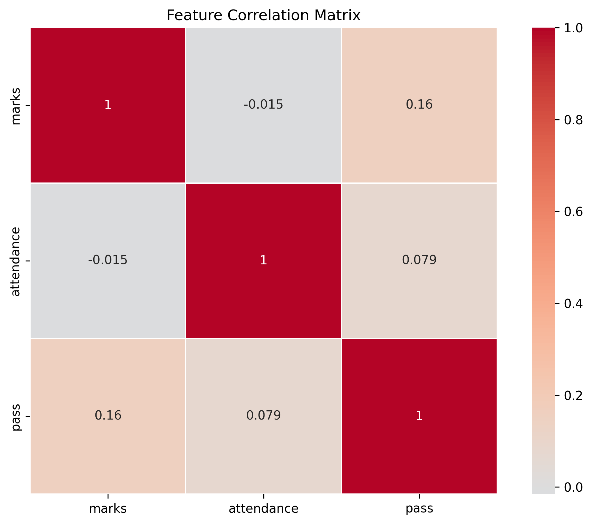
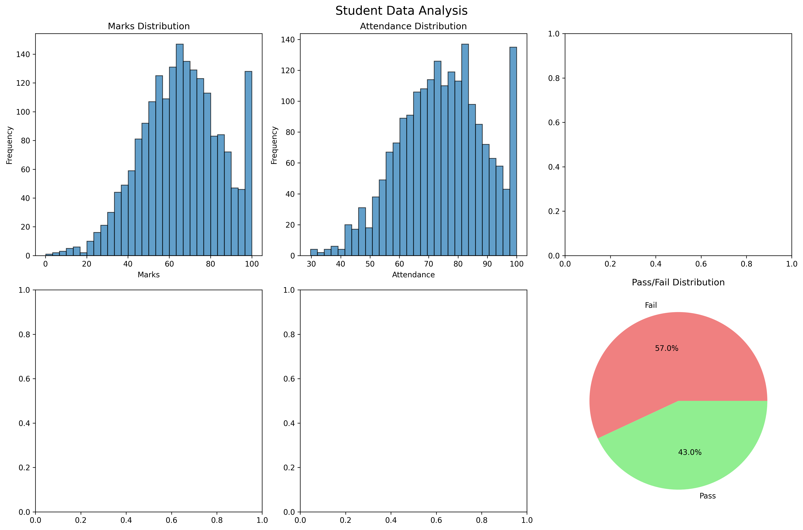

# 🎓 AI-Powered Student Pass/Fail Predictor

A full-stack web application built with **Django** and **scikit-learn** that predicts whether a student will **pass or fail** based on academic and behavioral features. The app uses a trained **Random Forest Classifier** to deliver real-time predictions through an intuitive web interface.


---

## 📋 Table of Contents

- [Features](#-features)
- [Tech Stack](#-tech-stack)
- [Project Structure](#-project-structure)
- [Prerequisites](#-prerequisites)
- [Installation & Setup](#-installation--setup)
- [Usage](#-usage)
- [Input Features](#-input-features)
- [Model Details](#-model-details)
- [Screenshots](#-screenshots)
- [Contributing](#-contributing)
- [License](#-license)

---

## ✨ Features

- **Real-Time Predictions** — Enter student data and get instant pass/fail predictions with confidence scores
- **Machine Learning Pipeline** — Trained Random Forest model with StandardScaler preprocessing
- **6-Feature Input** — Considers marks, attendance, study hours, GPA, assignments, and participation
- **Prediction History** — All predictions are saved to a PostgreSQL database for review
- **Admin Dashboard** — Full Django admin panel with filtering, searching, and data management
- **Responsive UI** — Clean, styled web interface with form validation and error handling
- **Data Visualization** — Includes correlation matrix and data analysis charts

---

## 🛠 Tech Stack

| Layer        | Technology                          |
| ------------ | ----------------------------------- |
| **Backend**  | Django 5.2, Python 3.10+            |
| **ML Model** | scikit-learn (Random Forest), NumPy, Pandas |
| **Database** | PostgreSQL                          |
| **Frontend** | Django Templates, HTML5, CSS3       |
| **Config**   | python-decouple (`.env` support)    |

---

## 📁 Project Structure

```
AI-powered-Student-predicter/
├── manage.py                   # Django management script
├── train_model.py              # ML model training script
├── student_model.pkl           # Trained model (serialized pipeline)
├── requirements.txt            # Python dependencies
├── .env                        # Environment variables (DB credentials)
├── correlation_matrix.png      # Feature correlation heatmap
├── data_analysis.png           # Exploratory data analysis chart
│
├── student_predictor/          # Django project settings
│   ├── settings.py             # Project configuration
│   ├── urls.py                 # Root URL routing
│   ├── wsgi.py                 # WSGI entry point
│   └── asgi.py                 # ASGI entry point
│
└── predictor/                  # Main Django app
    ├── models.py               # StudentPrediction database model
    ├── views.py                # View logic (index, predict, results)
    ├── urls.py                 # App URL patterns
    ├── admin.py                # Admin panel configuration
    ├── ml_model.py             # ML model loader & prediction interface
    ├── templates/
    │   ├── base.html           # Base template
    │   ├── index.html          # Input form page
    │   └── results.html        # Prediction results page
    └── static/
        └── predictor/
            └── style.css       # Application styles
```

---

## 📌 Prerequisites

Before you begin, ensure you have the following installed:

- **Python 3.10+** — [Download](https://www.python.org/downloads/)
- **PostgreSQL 15+** — [Download](https://www.postgresql.org/download/)
- **pip** — Comes bundled with Python
- **Git** — [Download](https://git-scm.com/downloads)

---

## 🚀 Installation & Setup

### 1. Clone the Repository

```bash
git clone https://github.com/sujansubedi89/AI-powered-Student-predicter.git
cd AI-powered-Student-predicter
```

### 2. Create & Activate Virtual Environment

```bash
# Create virtual environment
python -m venv venv

# Activate (Windows)
venv\Scripts\activate

# Activate (macOS/Linux)
source venv/bin/activate
```

### 3. Install Dependencies

```bash
pip install -r requirements.txt
```

### 4. Configure Environment Variables

Create a `.env` file in the project root (or edit the existing one):

```env
DB_NAME=student_predictor_db
DB_USER=your_postgres_user
DB_PASSWORD=your_postgres_password
DB_HOST=localhost
DB_PORT=5432

SECRET_KEY='your-secret-key-here'
DEBUG=True
```

### 5. Set Up the Database

Create the PostgreSQL database:

```sql
-- In psql or pgAdmin
CREATE DATABASE student_predictor_db;
```

Run Django migrations:

```bash
python manage.py makemigrations
python manage.py migrate
```

### 6. Train the ML Model

```bash
python train_model.py
```

This will:
- Generate synthetic training data (1,000 samples)
- Train a Random Forest Classifier with StandardScaler preprocessing
- Print accuracy metrics and a classification report
- Save the trained pipeline to `student_model.pkl`

### 7. Create a Superuser (Optional — for Admin Panel)

```bash
python manage.py createsuperuser
```

### 8. Run the Development Server

```bash
python manage.py runserver
```

Visit **http://127.0.0.1:8000/** in your browser.

---

## 💡 Usage

### Making a Prediction

1. Open the app at `http://127.0.0.1:8000/`
2. Fill in the student data form with the required fields
3. Click **Predict** to submit
4. View the prediction result (Pass/Fail) along with the confidence score

### Viewing History

- Navigate to `http://127.0.0.1:8000/results/` to see recent predictions

### Admin Panel

- Navigate to `http://127.0.0.1:8000/admin/`
- Log in with your superuser credentials
- View, filter, and search all prediction records

---

## 📊 Input Features

The model accepts the following 6 input features:

| Feature           | Range    | Description                           |
| ----------------- | -------- | ------------------------------------- |
| **Marks**         | 0 – 100  | Student's exam/test marks             |
| **Attendance**    | 0 – 100% | Class attendance percentage           |
| **Study Hours**   | 0 – 12   | Average daily study hours             |
| **Previous GPA**  | 0 – 4.0  | GPA from previous semester            |
| **Assignments**   | 0 – 100% | Assignment completion rate            |
| **Participation** | 0 – 100% | Class participation score             |

---

## 🤖 Model Details

| Property            | Value                                      |
| ------------------- | ------------------------------------------ |
| **Algorithm**       | Random Forest Classifier                   |
| **Preprocessing**   | StandardScaler (feature normalization)     |
| **Pipeline**        | scikit-learn `Pipeline` (scaler → classifier) |
| **Estimators**      | 100 trees                                  |
| **Max Depth**       | 10                                         |
| **Min Samples Split** | 5                                        |
| **Training Data**   | 1,000 synthetic samples (configurable)     |
| **Test Split**      | 80/20 (stratified)                         |
| **Serialization**   | joblib (`.pkl` format)                     |

### Feature Weights (in synthetic data generation)

| Feature        | Weight |
| -------------- | ------ |
| Marks          | 40%    |
| Attendance     | 20%    |
| Previous GPA   | 15%    |
| Study Hours    | 10%    |
| Assignments    | 10%    |
| Participation  | 5%     |

> **Note:** You can replace the synthetic data generation in `train_model.py` with your own real-world dataset for improved accuracy.

---

## 📸 Screenshots

### Correlation Matrix


### Data Analysis


---

## 🤝 Contributing

Contributions are welcome! Here's how to get started:

1. **Fork** the repository
2. **Create** a feature branch: `git checkout -b feature/your-feature`
3. **Commit** your changes: `git commit -m "Add your feature"`
4. **Push** to the branch: `git push origin feature/your-feature`
5. **Open** a Pull Request

---

## 📄 License

This project is open source and available under the [MIT License](LICENSE).

---

## 👤 Author

**Sujan Subedi**
- GitHub: [@sujansubedi89](https://github.com/sujansubedi89)

---

<p align="center">
  Made with ❤️ using Django & scikit-learn
</p>
